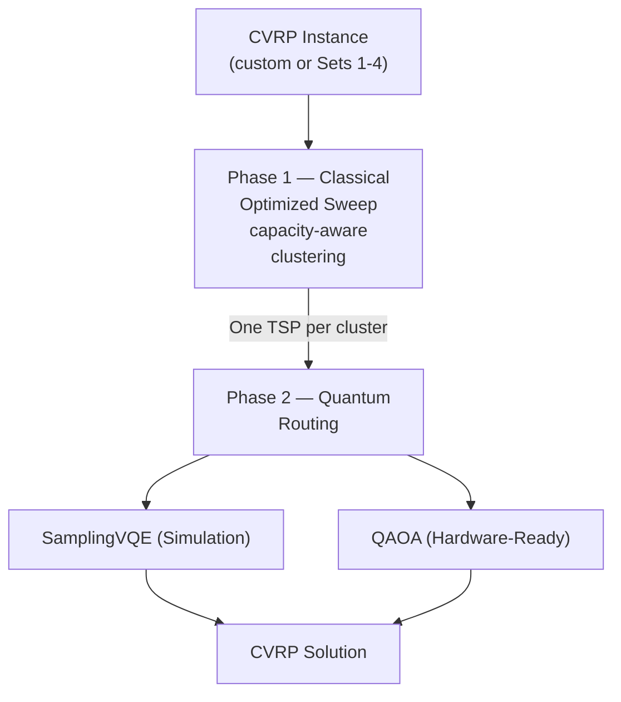
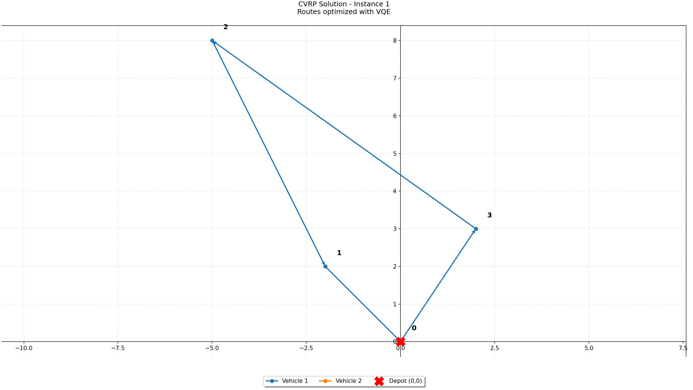
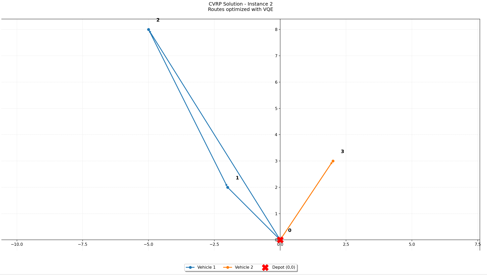
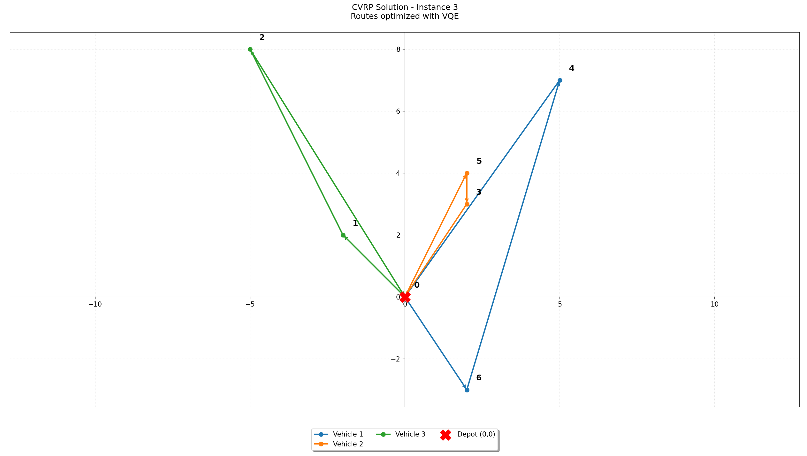
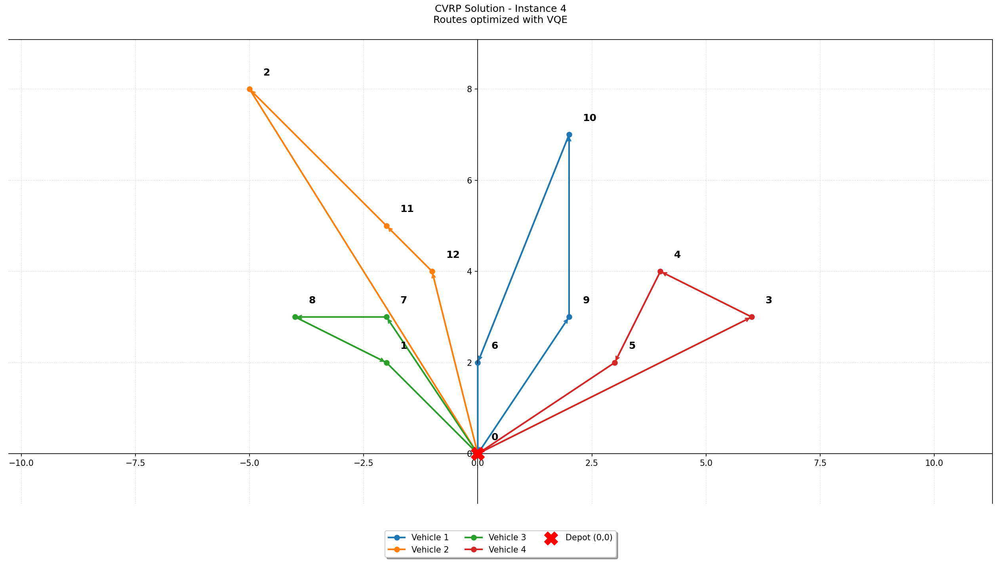

# Quantum Courier — Hybrid Quantum-Classical CVRP Solver
### Yale Hackathon 2026 · RTX (RTRC) × QuantumCT × qBraid

> A **NISQ-aware hybrid solver** for the Capacitated Vehicle Routing Problem, combining a novel rotation-optimized sweep algorithm with two quantum backends: **SamplingVQE** for high-fidelity simulation and **QAOA** as the path-to-real-hardware implementation.

---

## Table of Contents

1. [Problem & Motivation](#1-problem--motivation)
2. [Architecture Overview](#2-architecture-overview)
3. [Key Innovations](#3-key-innovations)
4. [Phase 1 — Rotation-Optimized Sweep Clustering](#4-phase-1--rotation-optimized-sweep-clustering)
5. [Phase 2 — Dual Quantum Backend Strategy](#5-phase-2--dual-quantum-backend-strategy)
   - [5a. SamplingVQE — Primary Solver (Simulation)](#5a-samplingvqe--primary-solver-simulation)
   - [5b. QAOA — Real Hardware Implementation](#5b-qaoa--real-hardware-implementation)
6. [Quantum Resource Analysis](#6-quantum-resource-analysis)
7. [Results](#7-results)
8. [Repository Structure](#8-repository-structure)
9. [Setup & Usage](#9-setup--usage)
10. [Scalability & Future Work](#10-scalability--future-work)
11. [Development Team](#11-development-team)
12. [References](#12-references)

---

## 1. Problem & Motivation

The **Capacitated Vehicle Routing Problem (CVRP)** asks: *given a depot and a set of customers with known demands, find the minimum-cost set of routes for a fleet of capacity-limited vehicles.*

It is **NP-hard** — solution space grows exponentially with problem size, making it intractable for classical exact solvers at scale. Even a **0.5% improvement** in route quality translates to millions of dollars in annual logistics savings for companies like RTX.

Quantum algorithms offer a fundamentally different search strategy over the combinatorial solution space. Our goal is to demonstrate a **practical, resource-efficient hybrid approach** that produces high-quality solutions on today's simulators, while remaining ready to deploy on real quantum hardware as it matures.

---

## 2. Architecture Overview

We employ a **"Cluster-First, Route-Second"** decomposition strategy — a principled divide-and-conquer approach that breaks the global CVRP into a series of small Traveling Salesman Problems (TSPs), each solvable by a quantum circuit.



This hybrid design is **intentional**: classical computers excel at geometric partitioning; quantum computers offer a search advantage on discrete combinatorial optimization. We let each do what it does best — and we provide two quantum backends, each optimized for a different execution context.

---

## 3. Key Innovations

### Novel: Rotation-Optimized Sweep
Standard sweep algorithms use a fixed starting angle, which can produce suboptimal cluster boundaries by accident of geometry. Our implementation **exhaustively searches all possible starting angles** and selects the partition that minimizes total angular spread across all clusters. This guarantees the globally optimal sweep partition — not just a locally good one — at negligible additional cost ($O(n)$ extra iterations).

### Dual Quantum Backend: Simulation Fidelity + Hardware Readiness
We developed and maintain **two independent quantum implementations** of the TSP solver, each suited to a different deployment context. SamplingVQE's flexible ansatz converges efficiently on simulators; QAOA's fixed circuit structure maps cleanly onto real QPU gate sets. This dual strategy lets us produce real results today while remaining ready to run on actual quantum hardware.

### NISQ-Aware Cluster Sizing
Cluster sizes are deliberately kept at $n \leq 4$ customers, requiring at most $n^2 = 16$ qubits per sub-problem. This is not a limitation — it is a **conscious hardware-aware design choice** that ensures the quantum circuits remain feasible on current NISQ simulators and real hardware without error correction.

### Modular, Upgradeable Architecture
Each component (clustering, QUBO mapping, quantum execution) is independently swappable. Switching between VQE and QAOA backends, increasing circuit depth, or scaling cluster sizes requires changes in a single module.

---

## 4. Phase 1 — Rotation-Optimized Sweep Clustering

Customers are mapped to **polar coordinates** $(r, \theta)$ relative to the central depot at $(0, 0)$, then sorted by angle $\theta$. A sweep groups consecutive customers into clusters of size $\leq C$ (vehicle capacity).

The innovation is in how the sweep's starting angle is chosen:

```python
for start_idx in range(n_nodes):                          # Try every starting angle
    rotated_nodes = [nodes_angle[(start_idx + i) % n_nodes]
                     for i in range(n_nodes)]
    ...
    spread = (angle_end - angle_start) % (2 * math.pi)   # Angular spread per cluster
    current_angle_sum += spread

if current_angle_sum < lowest_angle_sum:                  # Keep global minimum
    best_clusters = current_clusters
```

By minimizing **total angular spread**, we ensure each vehicle operates in a geometrically compact, non-overlapping sector. A compact cluster produces a nearly planar distance matrix, which both VQE and QAOA optimize more effectively at low circuit depth — meaning our clustering directly improves quantum solution quality.

---

## 5. Phase 2 — Dual Quantum Backend Strategy

A key engineering decision in this project was the choice of quantum algorithm for the TSP routing phase. We implemented and maintain **both SamplingVQE and QAOA**, for complementary reasons.

### Why Two Algorithms?

QAOA and VQE solve the same problem (finding the minimum energy of a cost Hamiltonian) but make fundamentally different trade-offs:

| Property | QAOA | SamplingVQE |
|----------|------|-------------|
| Circuit structure | Fixed, problem-derived | Flexible (learnable ansatz) |
| Simulation efficiency | Moderate — deep circuits | High — shallow, hardware-efficient ansatz |
| Convergence on simulator | Slower, more sensitive to $p$ | Faster, more robust |
| Real hardware suitability | Excellent — native gate structure | Good — requires ansatz transpilation |
| Theoretical quantum advantage | Stronger theoretical grounding | More empirical |

**In practice on classical simulators**, QAOA's deep, problem-specific circuits are slower to simulate and harder to converge than VQE's shallow parameterized ansatz. However, QAOA's fixed gate structure closely matches the native operations of real QPUs — ZZ-interaction layers map directly to the entangling gates of superconducting and trapped-ion hardware — making it the stronger candidate for actual quantum hardware execution.

Our dual-backend design reflects this reality explicitly rather than hiding it behind a single algorithm choice.

---

### 5a. SamplingVQE — Primary Solver (Simulation)

SamplingVQE is the backend used to produce our submitted results. It uses a **`RealAmplitudes` ansatz** — a hardware-efficient parameterized circuit with alternating rotation and entanglement layers — transpiled to the AerSimulator's native gate set before optimization.

**Pipeline:**


**Design choices:**

| Parameter | Value | Rationale |
|-----------|-------|-----------|
| Ansatz | `RealAmplitudes` | Hardware-efficient; shallow depth, full entanglement |
| `reps` | 3 | Increased expressibility for complex instances |
| Optimizer | SPSA | Simultaneous Perturbation Stochastic Approximation; robust on noisy landscapes |
| `maxiter` | 500 | Extended convergence budget for the variational loop |
| Backend | `AerSimulator` | High-fidelity local simulation via Qiskit Aer |

---

### 5b. QAOA — Real Hardware Implementation

The QAOA implementation is maintained as the **path-to-hardware** backend. While SamplingVQE converges faster on simulators, QAOA's circuit structure is inherently aligned with the gate sets of real superconducting and trapped-ion QPUs.

**Pipeline:**


**Design choices:**

| Parameter | Value | Rationale |
|-----------|-------|-----------|
| QAOA layers $p$ | Tunable | See discussion below |
| Optimizer | COBYLA | Derivative-free; suitable for smooth circuit landscapes |
| `maxiter` | 500 | Balanced convergence budget |
| `tol` | 1e-3 | Prevents premature termination |
| Sampler | `StatevectorSampler` | Exact statevector for high-fidelity simulation |

### The Depth–Noise Tradeoff

The number of QAOA layers $p$ is the most critical hyperparameter. Theoretically, **as $p \to \infty$, QAOA converges to the exact optimal solution** — the algorithm becomes equivalent to adiabatic quantum computation. In practice, however, increasing $p$ means deeper circuits with more gate operations, which makes the computation **exponentially more sensitive to hardware noise** (decoherence, gate errors).

This creates a fundamental tradeoff:

- **Low $p$** (e.g., $p=1$): Short circuits, noise-resilient, but the approximation ratio is poor — the optimizer often gets trapped in local minima.
- **Moderate $p$** (e.g., $p=3{-}5$): Better approximation quality while keeping circuit depth manageable on NISQ devices. This is our current operating regime.
- **High $p$** (e.g., $p > 10$): Near-optimal solutions in theory, but on real hardware the accumulated noise degrades results faster than the deeper circuit improves them.

Our architecture makes $p$ a simple configurable parameter, allowing us to increase depth as hardware noise floors improve.

**Switching to real hardware** requires only replacing `StatevectorSampler` with a hardware-backed sampler (e.g., a qBraid or IBM Runtime sampler) — the circuit structure and optimization loop remain unchanged.

---

## 6. Quantum Resource Analysis

### Classical vs. Quantum Responsibility

| Task | Method | Why |
|------|--------|-----|
| Capacity partitioning | Classical sweep | Trivially solved classically; no quantum advantage |
| Route optimization within cluster | SamplingVQE / QAOA | Discrete combinatorial search — quantum advantage domain |
| Parameter training | SPSA / COBYLA (classical outer loop) | Handles variational parameter landscape classically |

### Resource Efficiency by Design

Solving the full CVRP directly on a quantum computer with $N$ customers would require $O(N^2)$ qubits for the QUBO encoding — quickly exceeding any current hardware budget. By decomposing into clusters of size $\leq 4$, we bound qubit usage at **16 qubits per sub-problem**, regardless of total problem size.

| Cluster size $n$ | Qubits ($n^2$) | VQE gate depth | QAOA gate depth ($p=3$) |
|-----------------|----------------|----------------|------------------------|
| 3 | 9 | 11 | Moderate |
| 4 | 16 | 18 - 24 | Manageable on NISQ |

The quantum resource cost scales with **cluster size** (fixed by design at $\leq 4$), not with **total problem size** — a crucial distinction for practical NISQ deployment.

---

## 7. Results

Results produced using the **SamplingVQE backend** on the qBraid AerSimulator.

| Instance | Known Optimal | Our Solution | Approximation Ratio | Execution Time | # of Qubits | # of Gate Operations |
|----------|--------------|--------------|---------------------|----------------|-------------|-----------------------|
| 1 | 21.74 | 21.74 | 1.00 | ~6.0 s | 16 | 63 |
| 2 | 26.18 | 26.18 | 1.00 | ~3.8 s | 9 | 50 |
| 3 | 49.50 | 50.70 | 1.02 | ~7.2 s | 9 | 105 |
| 4 | 61.85 *(heuristic)*| **59.66** | **0.96** ✓ | ~188.9 s | 16 | 500 |

> **Approximation Ratio** = Our Solution / Known Optimal. Closer to 1.00 is better; below 1.00 means we outperform the reference.

### Visualizations

| Instance 1 | Instance 2 |
|:---:|:---:|
|  |  |
| **Instance 3** | **Instance 4** |
|  |  |

**Best routes found:**

```text
# Instance 1
r1: 0, 3, 2, 1, 0
r2: 0, 0

# Instance 2
r1: 0, 2, 1, 0
r2: 0, 3, 0

# Instance 3
r1: 0, 6, 4, 0
r2: 0, 5, 3, 0
r3: 0, 1, 2, 0

# Instance 4
r1: 0, 9, 10, 6, 0
r2: 0, 12, 11, 2, 0
r3: 0, 7, 8, 1, 0
r4: 0, 3, 4, 5, 0
```

> Note: Instance 4's reference distance (61.85) is a heuristic bound, not a proven optimum. Our solution at 59.66 outperforms it.

---

## 8. Repository Structure

```text
.
├── main.py                        # Entry point — runs the full solver on a given instance
├── requirements.txt               # Python dependencies
├── utils/
│   ├── tsp_solver.py              # VQE solver (primary — used for results)
│   ├── _clustering_qaoa.py        # QAOA solver (real hardware path)
│   ├── clustering.py              # Rotation-Optimized Sweep clustering algorithm
│   ├── data_loader.py             # Loads challenge instances (Sets 1–4)
│   ├── distance.py                # Distance matrix and node mapping utilities
│   ├── solution_storage.py        # Formats routes for hackathon submission
│   ├── metrics.py                 # Records qubit count, gate count, execution time
│   ├── visualization.py           # Route and instance visualization
│   └── exact_solver/              # Classical exact solver for benchmarking
├── results/                       # Curated results per instance, images, metrics and latest runs
└── challenge/                     # Original challenge resources
```

---

## 9. Setup & Usage

### Prerequisites

```bash
pip install -r requirements.txt
```

### Running the Solver

Set the desired instance in `main.py` or pass it as an argument:

```bash
# Run a specific instance (e.g., Instance 3)
python main.py 3

# Run ALL instances (1-4) sequentially
python main.py 0
```

**Outputs written to results/:**
- `instance_[N]/Instance[N].txt` → routes in hackathon format
- `all_run_results.csv` → execution time, distance, and quantum metrics (qubits, gates, depth)

### Switching to QAOA (Real Hardware Path)

To run the QAOA backend instead of VQE, update the imports in `main.py`:

```python
# Default (Simulation-optimized):
from utils.tsp_solver import solve_tsp_with_vqe as solve_tsp

# Switch to QAOA (Hardware-ready):
from utils._clustering_qaoa import solve_tsp_with_qaoa as solve_tsp
```

To target actual QPU hardware, replace `StatevectorSampler` in the QAOA module with a hardware-backed sampler from qBraid or IBM Runtime — no other changes required.

---

## 10. Scalability & Future Work

Our architecture is explicitly designed to evolve alongside quantum hardware:

| Hardware generation | Recommended backend | Supported upgrade |
|---------------------|--------------------|--------------------|
| Classical simulator (today) | SamplingVQE | Cluster size $n \leq 4$, `RealAmplitudes(reps=2)` |
| NISQ hardware (near-term) | QAOA | Swap sampler to QPU backend — circuit unchanged |
| Improved NISQ (2–3 years) | QAOA with larger $p$ | Increase $p$, grow cluster sizes to $n=5{-}6$ |
| Fault-tolerant era | Full CVRP quantum solve | No decomposition needed, solve globally |

The key insight: **geometric compactness of clusters directly correlates with quantum solution quality**. A compact cluster yields a near-planar distance matrix, which both VQE and QAOA optimize more effectively at low circuit depth. Our rotation-optimized sweep is engineered precisely to maximize this property — making the quantum phase as tractable as possible regardless of backend.

---

## 11. Development Team

- [**Alexis Pouliot**](https://github.com/PouliotAlexis)
- [**Amarey Farris Hajouji Idrissi Rios**](https://github.com/haja8956)
- [**Gabriel Michaud**](https://github.com/GabMichaud)
- [**Jasmin Pelletier**](https://github.com/Jas-pel)
- [**Laurier Perron**](https://github.com/perl2548)

---

## 12. References

1. Kim, J. S., Lee, D., & Ahn, C. W. (2026). *Quantum Heuristic Approach to Vehicle Routing Problem*. Mathematics, 14(6), 1026. [https://doi.org/10.3390/math14061026](https://doi.org/10.3390/math14061026)
2. L. Palackal, B. Poggel, M. Wulff, H. Ehm, J. M. Lorenz and C. B. Mendl. (2023). *Quantum-Assisted Solution Paths for the Capacitated Vehicle Routing Problem*. IEEE International Conference on Quantum Computing and Engineering (QCE), Bellevue, WA, USA, 2023, pp. 648-658. [doi: 10.1109/QCE57702.2023.00080](https://doi.org/10.1109/QCE57702.2023.00080).

---

*Developed for the Yale Hackathon 2026 — RTX (RTRC) × QuantumCT × qBraid.*